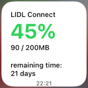
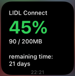

# Lidl-Connect-iOS-Widget

Mit diesem Script kann man mit der Scriptable App in iOS ein Widget erstellen, welches das verbrauchte bzw. restliche Datenvolumen eines Tarifs von LIDL Connect Deutschland anzeigt.

Das Script holt die Daten von `https://api.lidl-connect.de`. Dazu sind die Anmeldedaten notwendig mit denen man sich in der LIDL Connect App bzw. im Browser auf `kundenkonto.lidl-connect.de` anmeldet.

## Installation
* [Scriptable](https://apps.apple.com/de/app/scriptable/id1405459188) installieren und öffnen
* in Scriptable neues Script anlegen (auf Plus oben rechts drücken) und benennen 
* Text von [`lidl_connect.js`](https://raw.githubusercontent.com/yannikmotzet/Lidl-Connect-iOS-Widget/main/lidl_connect.js) in die Zwischenablage kopieren und in Scriptable einfügen
* im Script Login Informationan anpassen (Mobilfunknummer und Passwort)
* auf dem Home-Screen kleines Scriptable Widget hinzufügen, Widget bearbeiten und angelegtes Script auswählen

## Sonstiges
Inspiriert von [telekom.js](https://gist.github.com/Sillium/f904fb89444bc8dde12cfc07b8fa8728), [lidl-connect-exporter](https://github.com/felix-engelmann/lidl-connect-exporter).

Das Script [VodafoneDE.js](https://github.com/ThisIsBenny/iOS-Widgets/tree/main/VodafoneDE) funktioniert auch für LIDL Connect DE. Allerdings läuft die Anfrage der Daten nur über das Mobilfunknetz, d.h. bei einer aktiven WLAN Verbindung wird das Widget nicht aktualisiert.

Ob das Script in irgendeiner Form kompatibel zu LIDL Connect AT ist, wurde nicht getestet.